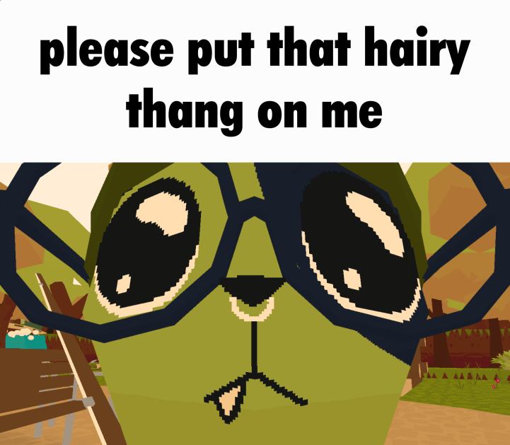

# Lobotomy Land Mods, Installer, and Documentation
## ****

# Description
This repository contains a mod installer/syncing script that adds stuff to the Silly Gay Fishing Game.™ 

**See the [Mod List.](#mod-list)** (Or, alternatively, dig through the files yourself. You can find them in the `GDWeave` folder.)

# Mod List
Yup. Here are the mods. Nothin to see here. Just, y'know, a bunch of mods. That exist. They're listed there, trust me. No need to scroll, you can just take me at my word for this one. They're there.

# Project Outline
1. Download mods from repository
2. Extract mods from tarball into game folder
    - might have to account for whether the game is installed on the main drive or another one
    - would reallllyyyy not be fun if i had to please god dont make me do this i have no idea how to dynamically find a steam game directory
3. 